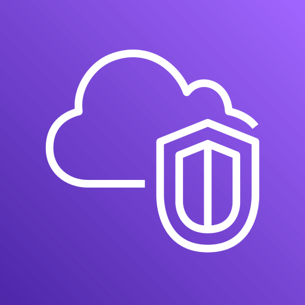

<h1 align="center">
    
  Amazon Virtual Private Cloud (VPC)
</h1>

**Amazon VPC** allows you to create a **logically isolated virtual network** in AWS, similar to a traditional on-premises data center or your private network at home, but with the scalability of AWS infrastructure. 

> [!IMPORTANT]\
> It is important to have an understanding of networking.

> [!NOTE]\
> A default VPC is provided automatically in each AWS Region to allow quick deployment of resources if no custom VPC is created.

---

## 🌐 Core components

- **VPCs & Subnets** – Define logical networks with IP ranges. Subnets exist within a single Availability Zone (AZ) and can be **public** or **private**.
- 
- **IP Addressing** – Supports **IPv4** and **IPv6**. You can also bring your own IP addresses ([BYOIP](https://docs.aws.amazon.com/AWSEC2/latest/UserGuide/ec2-byoip.html)). 
> [!NOTE]\
> Good to know the basics of [CIDR](https://www.geeksforgeeks.org/computer-networks/classless-inter-domain-routing-cidr/).

- **Routing** – Managed via **Route Tables** that direct traffic between subnets, VPCs, and external networks. 
- **Gateways & Endpoints** – 
  - **Internet Gateway (IGW)** – Enables communication between VPC resources and the **internet**. 
  - **NAT Gateway** – Allows **private** instances to access the internet securely without being exposed to inbound connections. 
  - **VPC Endpoints** – Enable private connectivity to AWS **services** without routing traffic over the internet. 
- **Peering Connections** – Allow communication between different VPCs, even across AWS Regions, using **VPC Peering** or **Transit Gateway**.
  
> [!IMPORTANT]\
> VPCs with overlapping CIDR ranges cannot have a VPC Peering connection.

---

## 🔒 Security & Control

- **Security Groups** – Virtual firewalls controlling inbound and outbound traffic for **instances**. 
- **Network ACLs (NACLs)** – Subnet-level firewalls offering stateless traffic security layer.
- **Flow Logs** – Capture and monitor IP traffic to and from network interfaces for **auditing** and **troubleshooting**. 

---

## 🔗 Interesting resources
- [What is Amazon VPC?](https://docs.aws.amazon.com/vpc/latest/userguide/what-is-amazon-vpc.html)
- [Introduction to AWS VPC](https://www.geeksforgeeks.org/devops/amazon-vpc-introduction-to-amazon-virtual-cloud/)

